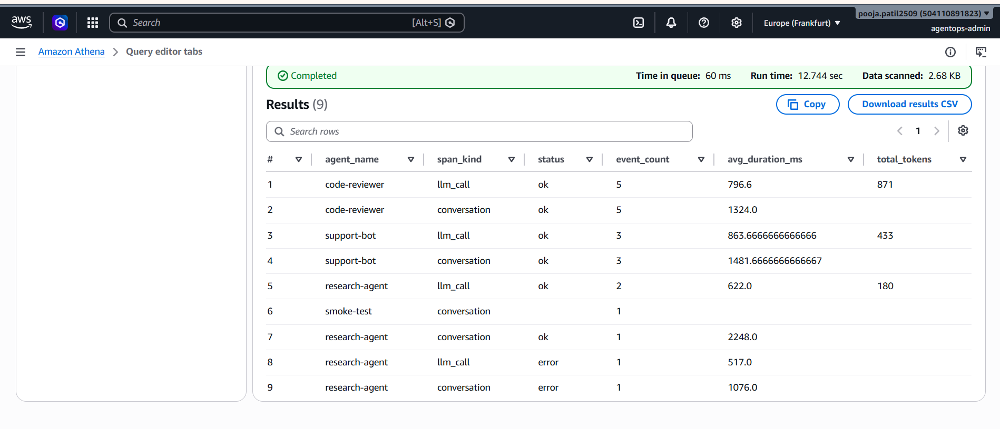
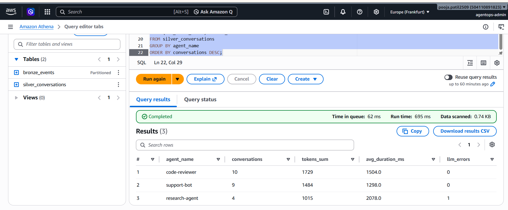

# AgentOps

> Production observability and cost platform for AI agents — built on AWS with a medallion lakehouse, real-time ingestion, and pluggable LLM providers.

AgentOps is a portfolio-scale data engineering project that solves a real problem in 2026: most companies deploying LLM-powered agents in production have no visibility into what those agents are doing, how much they cost per conversation, or when they hallucinate. AgentOps ingests OpenTelemetry-style trace events from instrumented agents, lands them in an Iceberg-based medallion lakehouse, detects anomalies in real time, and exposes natural-language analytics over the trace history.

## Architecture

**Ingestion (real-time):** Python SDK → HTTPS API Gateway → Lambda validator → Kinesis Data Streams → Kinesis Firehose → S3 Bronze (Parquet, partitioned by hour).

**Lakehouse (medallion):**
- **Bronze** — raw, immutable agent telemetry. JSON/Parquet on S3. Source of truth for replay.
- **Silver** — cleaned, deduplicated, PII-masked traces in Apache Iceberg. Per-conversation rows with typed columns.
- **Gold** — business aggregates and ML features. Per-agent cost, p95 latency, hallucination rate, token forecasts.

**Real-time path:** Kinesis → Lambda → Bedrock for live hallucination scoring → EventBridge → SNS/Slack alerts.

**Batch path:** Glue PySpark jobs orchestrated by Step Functions for Bronze→Silver→Gold transformations.

**Serving:** React dashboard on S3 + CloudFront. Natural language query interface backed by Bedrock text-to-SQL over Athena.

## Tech Stack

AWS (S3, Kinesis, Lambda, Glue, Athena, Bedrock, DynamoDB, API Gateway, Step Functions, EventBridge, SNS, Secrets Manager, KMS, IAM, CloudWatch) · Apache Iceberg · Terraform · Python 3.12 · Pydantic · React · GitHub Actions · Checkov · TFLint.

## Engineering Highlights

- **Customer-managed KMS encryption** with automatic key rotation across S3, CloudWatch Logs, SNS, and Secrets Manager. Key policy scoped via `EncryptionContext` to log groups in this account only.
- **Medallion lakehouse on S3 + Iceberg** with tiered storage (Bronze → Glacier IR at 30 days, 365-day expiration) reducing storage cost ~70% on aged data.
- **Pluggable LLM provider abstraction** supporting Anthropic API, AWS Bedrock (Claude, Llama, Titan), and a deterministic mock provider — same agent code, swap via one env var.
- **Streaming-first medallion** combining real-time micro-batch ingestion (Firehose) with batch transformations (Glue PySpark) and reconciliation between the two paths.
- **Multi-shard Kinesis Data Stream** with `trace_id` partition key ensuring per-conversation ordering, KMS encryption at rest, 24-hour retention for replay safety, on-demand auto-scaling.
- **Least-privilege IAM** with four service-specific roles (Lambda, Glue, Firehose, Step Functions), resources scoped via ARN prefixes, no wildcard permissions.
- **Remote Terraform state** in versioned S3 + DynamoDB lock table, multi-environment structure (`envs/dev`, ready for `envs/prod`).
- **Cost discipline** under $200 AWS credit budget, with billing alarms at $50/$100/$150 and `terraform destroy` between work sessions.
- **Bronze → Silver PySpark on AWS Glue 4.0** transforms raw spans into reconstructed conversations using window-function joins, source-side deduplication by `event_id` and `trace_id`, defensive PII re-hashing, and `MERGE INTO` for true idempotency. Verified by clearing Silver, running the job twice with no new input, and confirming identical row counts.
- **Apache Iceberg lakehouse format** in `s3://agentops-silver-pooja/warehouse/` provides ACID transactions, time-travel queries, schema evolution, and SQL `DELETE`/`UPDATE`/`MERGE` over S3 — capabilities plain Parquet cannot offer.
- **Production debugging discipline:** caught and resolved two Spark/Glue gotchas — `spark.sql.extensions` being a static-only config (must be set via Glue's `--conf` arg, not `spark.conf.set()`), and the importance of source-side dedup before MERGE to defend against duplicate inputs.

## Demo: Live Pipeline Verification

End-to-end traffic from a synthetic generator running on a developer laptop, queried via Athena:



The query above aggregates 10 conversations across three sample agents (support-bot,
research-agent, code-reviewer) plus one curl smoke-test, including one intentionally-injected
mock LLM error to validate failure propagation through the entire pipeline. End-to-end
latency from SDK call to S3 Bronze landing: ~60 seconds (Firehose buffer window).
Athena query latency over Bronze (Parquet, partition-pruned): 2–3 seconds.


The medallion is now populated at two layers — raw spans in Bronze, reconstructed
conversations in Silver. Query at the Silver layer aggregates by agent:

\```sql
SELECT
  agent_name,
  COUNT(*) AS conversations,
  SUM(total_tokens) AS tokens_sum,
  ROUND(AVG(conversation_duration_ms), 0) AS avg_duration_ms,
  SUM(llm_error_count) AS llm_errors
FROM silver_conversations
GROUP BY agent_name
ORDER BY conversations DESC;
\```



Returns per-agent rollups in under 2 seconds (Iceberg on S3 via Athena),
including total tokens, average duration, and error counts — the shape a
real-time agent observability dashboard needs.

## Repository Structure
```
agentops/
├── infra/                  # Terraform (modular, multi-env)
│   └── envs/dev/           # Dev environment
├── sdk/                    # Python agent SDK + synthetic generator
├── pipelines/              # Glue PySpark jobs (Phase 3)
├── dashboard/              # React dashboard (Phase 4)
├── docs/                   # Architecture diagrams, ADRs
└── .github/workflows/      # CI/CD (Phase 4)
```
## Project Status

| Phase | Scope | Status |
|-------|-------|--------|
| Phase 0 | AWS account, billing safety, IAM admin user, local toolchain, remote Terraform state | ✓ Complete |
| Phase 1.1 | KMS key, medallion S3 buckets, Glue Catalog, lifecycle policies | ✓ Complete |
| Phase 1.2 | IAM roles, CloudWatch log groups, SNS, EventBridge, Secrets Manager | ✓ Complete |
| Phase 2.1 | Agent SDK, pluggable LLM providers, synthetic traffic generator | ✓ Complete |
| Phase 2.2 | Kinesis + Firehose + ingestion API + Bronze writes | In progress |
| Phase 2.2a | API Gateway HTTP API + ingestion Lambda + Kinesis Data Stream | ✓ Complete |
| Phase 2.2b | Kinesis Firehose to S3 Bronze + Glue Crawler + Athena verification | ✓ Complete |
| Phase 3 | Glue Bronze→Silver→Gold + real-time anomaly detection | Planned |
| Phase 3.1 | Bronze → Silver PySpark job (Iceberg + dedup + PII + conversation reconstruction) | ✓ Complete |
| Phase 3.2 | Silver → Gold hourly aggregations | In progress |
| Phase 4 | React dashboard, NL query, CI/CD, demo polish | Planned |

## Getting Started

See [`sdk/README.md`](sdk/README.md) for SDK setup. See [`infra/envs/dev/`](infra/envs/dev/) for Terraform.

## Author

Built by Pooja as a portfolio project for data engineering and cloud engineering roles.